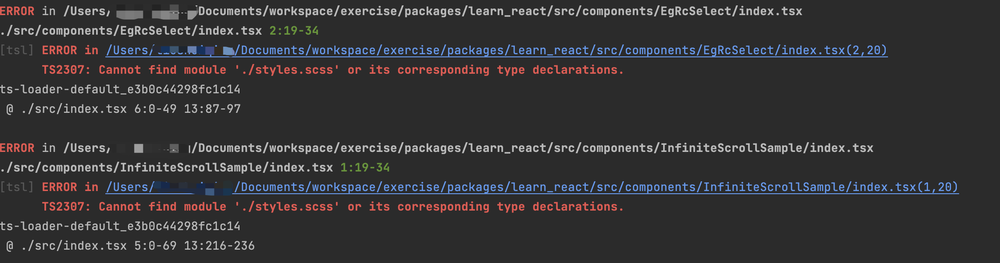
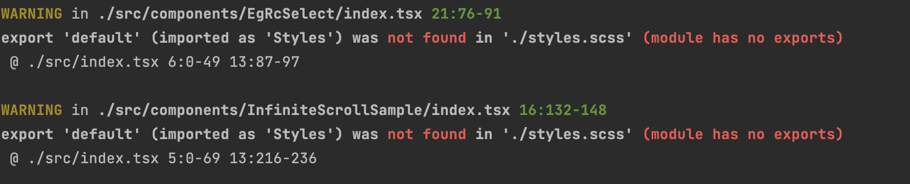

# eg_react
## 学习react
- 照着官网教程敲一遍代码，熟悉一下react的写法
- [官网教程](https://react.dev/learn/tutorial-tic-tac-toe)
- [从vue转到React遇到的疑惑或问题](./doc/index.md)

## 开始
- pnpm start

## 搭建react webpack的步骤
- pnpm init
- pnpm add react react-dom webpack webpack-cli
- npx webpack init
- 

## React官网部分译文
- [useState翻译](./translate/useState.md)
- [useEffect翻译](./translate/useEffect.md) `TODO`
- [build-in react hooks翻译](./translate/builtInReactHooks.md) `TODO`

## css
使用CSS Module
参考：[阮一峰的CSS Module教程](https://www.ruanyifeng.com/blog/2016/06/css_modules.html)
https://webpack.docschina.org/loaders/css-loader/

## 遇到的问题
- 报错：

解决方案： 在global.d.ts中添加
```typescript
declare module '*.scss'{
  const classes: { readonly [key: string]: string }
  export default classes
}
```

- 报错:

解决方案： 在webpack.config.js中添加：
```javascript
{
  loader: MiniCssExtractPlugin.loader,
  options: {
    esModule: false
  }
}
```

https://webpack.docschina.org/plugins/mini-css-extract-plugin/

mini-css-extract-plugin中的esModule默认为true，表示：将会生成使用 ES 模块语法的 JS 模块
后续发现不需要设置esModule为true也没问题了，但因为没法重现当时的问题，没法找解决方案了

- react-router vs react-router-dom
1. React Router
   react-router 是一个轻量级的基础库，它提供了React应用中路由的核心功能，包括路由组件和钩子（hooks）。它是构建在React环境中的路由解决方案的基础，并且是为任何React环境（如React Native）设计的。react-router 包含了共享的逻辑和组件，可用于Web和Native开发[1]。

2. React Router DOM
   react-router-dom 是专门为Web应用构建的库，它建立在react-router之上，并且引入了一些在浏览器环境中特有的组件和API，例如<BrowserRouter>、<Link>、<NavLink> 和<Switch>。如果你正在开发一个运行在浏览器中的Web应用，你应该使用react-router-dom，它包括了react-router的所有功能，并且添加了一些额外的功能和组件，专门用于Web开发[2]。

3. 总结
   如果你在开发Web应用，请使用react-router-dom，它提供了更多针对Web开发的特性和组件。
   如果你在开发非Web环境下的React应用（如React Native），则应该使用react-router。
   在大多数情况下，对于Web应用开发者来说，直接安装和使用react-router-dom就足够了，因为它包括了react-router所提供的所有功能。
